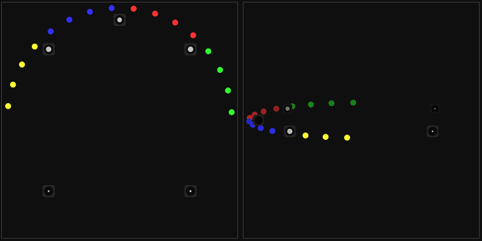

<div align="center">
	
[](https://github.com/Jaytheway/JPLSpatial/actions/workflows/build.yml) 

</div>

# JPLSpatial

Sound spatialization and propagation library.

**No external dependencies** for the main library, only Tests and Examples (TBD) require a few external libraries.

## Status
Functional WIP

## Where it's used
JPLSpatial library is used as a sound spatialization solution in [Hazel Engine](https://hazelengine.com/).
If you have access to Hazel Engine code, you can check how JPLSpatial is integrated on `dev` or `audio` branch.
## Features

#### Vector-Base Amplitude Panning (VBAP) / Multi-Direction Amplitude Panning (MDAP)



- Source elevation / Height channels

- <details>
	<summary>Supported source channel layouts</summary>
	<ul>
	<li>Mono</li>
	<li>Stereo</li>
	<li>LCR</li>
	<li>Quad</li>
	<li>Surround 4.1</li>
	<li>Surround 5.0</li>
	<li>Surround 5.1</li>
	<li>Surround 6.0</li>
	<li>Surround 6.1</li>
	<li>Surround 7.0</li>
	<li>Surround 7.1</li>
	<li>Octagonal</li>
	</ul>
</details>

- <details>
	<summary>Supported target/output channel layouts</summary>
	<ul>
	<br>
	<b>VBAPanner2D</b>

	---
	
	<li>Stereo</li>
	<li>LCR</li>
	<li>Quad</li>
	<li>Surround 4.1</li>
	<li>Surround 5.0</li>
	<li>Surround 6.0</li>
	<li>Surround 5.1</li>
	<li>Surround 6.1</li>
	<li>Surround 7.0</li>
	<li>Surround 7.1</li>
	<li>Octagonal</li>

	<br>
	<b>VBAPanner3D</b> <i>(layouts with top channels)</i>

	---
	
	<li>Surround 5.0.2</li>
	<li>Surround 5.1.2</li>
	<li>Surround 5.0.4</li>
	<li>Surround 5.1.4</li>
	<br>		
	<i>(as per Dolby Atmos surround, but LFE is always 4th channel)</i>

	<li>Surround 7.0.2</li>
	<li>Surround 7.1.2</li>
	<li>Surround 7.0.4</li>
	<li>Surround 7.1.4</li>
	<li>Surround 7.0.6</li>
	<li>Surround 7.1.6</li>
	<li>Surround 9.0.4</li>
	<li>Surround 9.1.4</li>
	<li>Surround 9.0.6</li>
	<li>Surround 9.1.6</li>
	</ul>
</details>

#### Distance Attenuation
- Custom function
- Curves
- Predefined models:
	- Inverse
	- Linear
	- Exponential
#### Angle Attenuation / Cone-based attenuation
#### **High level sound source API**:

- Spatial Manager (top level interface managing Sources and Services)
- Panning Service
- Direct Path Service (for now handles just distance and angle attenuation)
  
## Supported platforms

* Windows (Desktop) x64/ARM64
* Linux (tested on Ubuntu) x64/ARM64
* macOS x64/ARM64

## Examples & Usage
Initializing `VBAPPanner`, `SourceLayout` and querying target channel gains for a source direction:
```cpp
#include "JPLSpatial/ChannelMap.h"
#include "JPLSpatial/Panning/VBAPanning2D.h"

#include <span>
...

using PannerType = typename JPL::VBAPanner2D<>;
using SourceLayout = typename PannerType::SourceLayoutType;
using ChannelGains = typename JPL::VBAPStandartTraits::ChannelGains;

const auto targetChannelMap = JPL::ChannelMap::FromChannelMask(JPL::ChannelMask::Stereo)
const auto sourceChannelMap = JPL::ChannelMap::FromChannelMask(JPL::ChannelMask::Mono)

PannerType panner;
panner.InitializeLUT(targetChannelMap);

SourceLayout sourceLayout;
panner.InitializeSourceLayout(sourceChannelMap, sourceLayout)

...

// `outGains` is going to be filled with the computed panning gains
// based on input parameters
void GetChannelGains(
	const SourceLayout& sourceLayout,
 	Vec3 sourceDirection,
  	float focus, float spread
 	ChannelGains& outGains)
{
	if (panner.IsInitialized())
	{
		typename PannerType::PanUpdateData positionData
		{
			.SourceDirection = sourceDirection,
			.Focus = focus,
			.Spread = spread
		};

		panner.ProcessVBAPData(
			sourceLayout,
			positionData,
			[&outGains](uint32 /*channel*/) -> auto& { return outGains; });
	}
}

```

### SpatialManager quickstart
A typical `SpatialManager` workflow wires together high-level constructs such as `SourceInitParameters` for allocating the source,
`Position` for spatial placement, and an `AttenuationCurve` for distance rolloff.

```cpp
#include "JPLSpatial/ChannelMap.h"
#include "JPLSpatial/Math/MinimalVec3.h"
#include "JPLSpatial/SpatialManager.h"

using Vec3 = JPL::MinimalVec3;
using Spatializer = JPL::Spatial::SpatialManager<Vec3>;

Spatializer spatializer;
const auto targetChannels = JPL::ChannelMap::FromChannelMask(JPL::ChannelMask::Quad);

SourceInitParameters initParams{
        .NumChannels = 1,
        .NumTargetChannels = targetChannels.GetNumChannels()
};
const SourceId source = spatializer.CreateSource(initParams);

Position<Vec3> sourcePosition{
        .Location = Vec3(0.0f, 0.0f, -5.0f),
        .Orientation = Orientation<Vec3>::Identity()
};
spatializer.SetSourcePosition(source, sourcePosition);

auto* curve = new AttenuationCurve();
curve->Points = {
        {.Distance = 0.0f, .Value = 1.0f, .FunctionType = Curve::EType::Linear},
        {.Distance = 10.0f, .Value = 0.5f, .FunctionType = Curve::EType::Linear}
};
curve->SortPoints();
const auto curveHandle = spatializer.GetDirectPathService().AssignAttenuationCurve(
        spatializer.GetDirectEffectHandle(source), curve);

spatializer.AdvanceSimulation();

const float distanceAttenuation = spatializer.GetDistanceAttenuation(source, curveHandle);
const auto channelGains = spatializer.GetChannelGains(source, targetChannels);
```

Once `AdvanceSimulation` has processed the scene, `GetLastUpdatedSource` exposes which sources were touched, and the cached
results retrieved through `GetDistanceAttenuation` and `GetChannelGains` can be fed directly into the audio mix for the
current frame.

### Manual <code>PanningService</code> usage

- <details>
	<p>
	When working directly with the panning layer you start by creating the source and target <code>ChannelMap</code> objects that describe each layout you want to support. Those maps are passed to <code>InitializePanningEffect</code>, which returns a <code>PanEffectHandle</code> representing the source's cached panning state. Hold on to that handle for subsequent updates, and query the cached gains after evaluation through <code>GetChannelGainsFor</code>. See <a href="Spatialization/include/JPLSpatial/Services/PanningService.h">PanningService.h</a> and the sequence in <a href="SpatializationTests/src/Tests/PanningServiceTest.h">PanningServiceTest</a> for a full example.
	</p>

	<p>
	A typical update loop mirrors the sequence covered in <code>PanningServiceTest</code>: set the focus/spread shaping via <code>SetPanningEffectParameters</code> (or adjust spread alone with <code>SetPanningEffectSpread</code>) and then call <code>EvaluateDirection</code> with the latest <code>Position</code> to refresh the cached gain buffers. This flow keeps directional data and spread control in sync before the gains are read back for mixing.
	</p>

	<p>
	Remember to release handles that are no longer needed by calling <code>ReleasePanningEffect</code>; consult <a href="Spatialization/include/JPLSpatial/Services/PanningService.h">Services/PanningService.h</a> for the full API surface, including helpers for advanced caching scenarios.
	</p>
</details>

### DirectPathService walkthrough

`DirectPathService` owns the distance and cone attenuation caches that the high-level `SpatialManager` queries every update frame. A typical low-level setup is:

```cpp
#include "JPLSpatial/DistanceAttenuation.h"
#include "JPLSpatial/Math/Math.h"
#include "JPLSpatial/Math/MinimalVec3.h"
#include "JPLSpatial/Services/DirectPathService.h"

using DirectPath = JPL::DirectPathService<>;
using Vec3 = JPL::MinimalVec3;

DirectPath directPath;
JPL::DirectEffectInitParameters initParams{
        .BaseCurve = nullptr,
        .AttenuationCone = {.InnerAngle = JPL::Math::ToRadians(60.0f), .OuterAngle = JPL::Math::ToRadians(120.0f)}
};
JPL::DirectEffectHandle handle = directPath.InitializeDirrectEffect(initParams);

auto* curve = new JPL::AttenuationCurve();
curve->Points = {
        {.Distance = 0.0f, .Value = 1.0f, .FunctionType = JPL::Curve::EType::Linear},
        {.Distance = 20.0f, .Value = 0.25f, .FunctionType = JPL::Curve::EType::Linear}
};
curve->SortPoints();
auto curveRef = directPath.AssignAttenuationCurve(handle, curve);

// Immediate evaluation against a single curve handle
const float preview = DirectPath::EvaluateDistance(5.0f, curveRef);

// Frame update path: evaluate and cache
JPL::Position<Vec3> source{{10.0f, 0.0f, -10.0f}, JPL::Orientation<Vec3>::IdentityForward()};
JPL::Position<Vec3> listener{{0.0f, 0.0f, 0.0f}, JPL::Orientation<Vec3>::IdentityForward()};
const auto directPathResult = DirectPath::ProcessDirectPath(source, listener);
directPath.EvaluateDistance(handle, directPathResult.Distance);
directPath.EvaluateDirection(handle, directPathResult.DirectionDot);

const float cachedDistanceFactor = directPath.GetDistanceAttenuation(handle, curveRef);
const float cachedConeFactor = directPath.GetDirectionAttenuation(handle);
```

`ProcessDirectPath` returns both `DirectionDot` (listener-forward alignment) and `InvDirectionDot` (source-forward alignment) so you can decide whether to reuse the listener-facing or source-facing cosine in subsequent frames—the [DirectPathService API](Spatialization/include/JPLSpatial/Services/DirectPathService.h) documents these fields, and [`DirectPathServiceTest`](SpatializationTests/src/Tests/DirectPathServiceTest.h) exercises scenarios such as a listener standing behind a source and validates the expected values. Once the per-frame `EvaluateDistance`/`EvaluateDirection` calls run, the cached values retrieved via `GetDistanceAttenuation`/`GetDirectionAttenuation` stay valid until the next evaluation, letting you keep the mixing hot-path free of curve traversals.

### Tuning angle-based roll-off

`AttenuationCone` contains the inner and outer angles in radians. The dot product fed into `EvaluateDirection` is compared against the cosines of half-angles: values above the inner threshold return a factor of `0.0f`, values below the outer threshold return `1.0f`, and everything in between linearly interpolates so you can remap that factor to any outer parameter you want (e.g., `std::lerp(1.0f, coneOuterFactor, filterCutoff)`). See the [DirectPathService header](Spatialization/include/JPLSpatial/Services/DirectPathService.h) for implementation details and [`DirectPathServiceTest`](SpatializationTests/src/Tests/DirectPathServiceTest.h) for usage examples. To tighten a spotlight-style emitter, reduce `OuterAngle` toward `InnerAngle`; to create a broad ambience, expand both toward `2π` so every direction yields the full gain of `1.0f` without angular attenuation. When paired with the cached cone gain above, this lets you reason in “forward energy” terms: the listener inside the inner cone hears the unattenuated signal, the outer region gradually blends toward your chosen tail gain, and anything behind the source sits at the outer gain floor.

## Coordinate System
In **JPLSpatial** the coordinate system is **right-handed** and uses a **Y-up axis**.
- Positive X-axis: to the **right**
- Positive vlaues of Y-axis: **upwards**
- Negative vlaues of Z-axis: **forwwrd**

Values passed to **JPLSpatial** have to be converted accordingly if the coordinate system they came from doesn't match the above.

## Folder structure
- **Spatialization** - source code for the library
- **SpatializationTests** - a set of tests to validate the behavior of the features and interfaces
- **docs** - so far non-functioning auto-generated documentation
- **build** - build scripts; running `cmake_vs2022_cl_x64.bat` will create VS 2022 solution
- **cmake** - cmake utilities
## Library structure
As much of the library as possible is header-only.

**JPLSpatial library is structured in a few hierarchical layers**:
- SpatialManager
	- Services
		- Low level features

..any layer can be used on its own for a more manual control.

---
- **SpatialManager.h** - top level interface that manages all the library services on the sound source level.
	- Services - each service handles a specific feature set, relevant data and updates, and serve as a higher level interfaces for low level features.
		- **PanningService.h** - VBAP/MDAP Panning, Virtual Sources
		- **DirectPathService.h** - Distance and Angle based Attenuation
		- ..others.
- *"Low level" features and utilities that can be used on their own:*
	- **ChannelMap.h**
	- **VBAP.h**
	- **DistanceAttenuation.h**
	- **Panning/VBAPEx.h**
## Documentation
- Most of the things annotated in code.
- For more examples check out tests.
- For an example of integrating **Services** take a look at [SpatialManager.h](https://github.com/Jaytheway/JPLSpatial/blob/main/Spatialization/include/JPLSpatial/SpatialManager.h)
## Compiling
- To build the library, run appropriate build script in `build` folder.
- Some includes can be used as is as a single header include in your project.
- Depends only on the standard template library.
- Tests fetch `glm` to validate `glm::vec3` type working with library's interfaces, and optionally can be ran with `JoltPhysics`'s `JPH::Vec3` by passing `-DTEST_WITH_JOLT=ON` flag to test project generator.
- Compiles with Visual Studio 2022 and Visual Studio 2026, other compiles haven't been tested.
- Uses C++20
## Updates
JPLSpatial is going to be updated as the need for more features matches my time availability to work on them.

> [!WARNING]
> - API may change
> - Things may get added, removed, and restructured
## License
The project is distributed under the [ISC license](https://github.com/Jaytheway/JPLSpatial?tab=License-1-ov-file).
