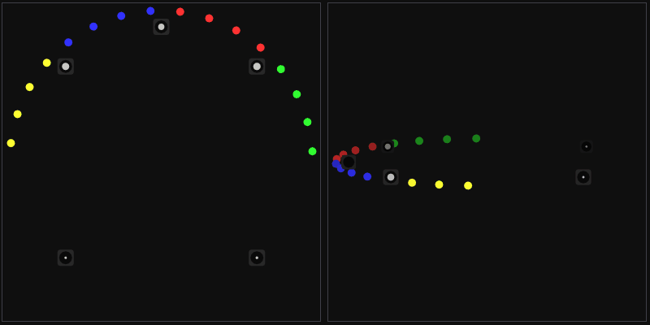

<div align="center">
	
[](https://github.com/Jaytheway/JPLSpatial/actions/workflows/build.yml) 

</div>

# JPL Spatial

Sound spatialization and propagation library.

**No external dependencies** for the main library, only Tests and Examples (TBD) require a few external libraries.

## Where it's used
**JPL Spatial** library is used as a sound spatialization solution in [Hazel Engine](https://hazelengine.com/).
If you have access to Hazel Engine code, you can check how **JPL Spatial** is integrated on `dev` or `audio` branch.

There is aslo [JPL Spatial Application](https://github.com/Jaytheway/JPLSpatialApplication/), showcasing and visualizing features of **JPL Spatial**.

## Features

### Vector-Base Amplitude Panning (VBAP) / Multi-Direction Amplitude Panning (MDAP)

 5.1 speaker layout" />

 9.1.4 speaker layout" />

**JPL Spatial** implementation of **VBAP/MDAP** handles source elevation and height channels.

<details>
<summary>Supported source channel layouts</summary>
<ul>
<li>Mono</li>
<li>Stereo</li>
<li>LCR</li>
<li>Quad</li>
<li>Surround 4.1</li>
<li>Surround 5.0</li>
<li>Surround 5.1</li>
<li>Surround 6.0</li>
<li>Surround 6.1</li>
<li>Surround 7.0</li>
<li>Surround 7.1</li>
<li>Octagonal</li>
</ul>
</details>

<details>
<summary>Supported target/output channel layouts</summary>
<ul>
<br>
<b>VBAPanner2D</b>

---

<li>Stereo</li>
<li>LCR</li>
<li>Quad</li>
<li>Surround 4.1</li>
<li>Surround 5.0</li>
<li>Surround 6.0</li>
<li>Surround 5.1</li>
<li>Surround 6.1</li>
<li>Surround 7.0</li>
<li>Surround 7.1</li>
<li>Octagonal</li>

<br>
<b>VBAPanner3D</b> <i>(layouts with top channels)</i>

---

<li>Surround 5.0.2</li>
<li>Surround 5.1.2</li>
<li>Surround 5.0.4</li>
<li>Surround 5.1.4</li>
<br>		
<i>(as per Dolby Atmos surround, but LFE is always 4th channel)</i>

<li>Surround 7.0.2</li>
<li>Surround 7.1.2</li>
<li>Surround 7.0.4</li>
<li>Surround 7.1.4</li>
<li>Surround 7.0.6</li>
<li>Surround 7.1.6</li>
<li>Surround 9.0.4</li>
<li>Surround 9.1.4</li>
<li>Surround 9.0.6</li>
<li>Surround 9.1.6</li>
</ul>
</details>

### Allocator-Aware Design & Memory Tracking
Where possible and reasonable `std::pmr` containers are used.  
*Polymorphic memory resource* can be provided to **JPL Spatial** containers and classes.

### SIMD / Vectorization
Fast `simd` math library is provideded and used extensively to speed up computation where reasonable.  
Decisions to sacrifice code readability in favor of performance are driven by **benchmarks**.

### Ray Tracing
- **JPL Spatial** implements interface to use you own **Ray Tracer** and **Vec3** type (though minimal **Vec3** class provided)
- In the future, **JPL Spatial**'s own **Ray Tracer** may be implemented

## Components
- **Interpolating Fractional Delay Lines**
- **4th order Linkwitz-Riley Crossover**
- **Filter Delay Network (FDN) Reverb**
- **SIMD** math library
- **Acoustic Materials** definition and a list of common materials to be used for acoustics simulation
- **Air Absorption** utilities for pure-tone and broadband estimation
- **Channel Map** utility for handling different kinds of channel layouts
- ...*a bunch of other utilities (math, algorithms, containers, etc.)*

## Propagation

- Specular **Early Reflections** are traced using **Image Source** method and panned by **VBAP** (single directoin per ER)

- **Late Reverberation Time** can be estimated with provided [Eyring](https://en.wikipedia.org/wiki/Reverberation#Eyring_equation) or [Sabine](https://en.wikipedia.org/wiki/Reverberation#Sabine_equation) equations based on environment properties. 

## Rendering
#### Direct Sound Effect
- renders *propagation delay* and *doppler effect* with **Interpolating Delay Lines**
- *propagation filtering* with **4-band Crossover Filter** (mainly *air absorption*)
- *panning* handled by **MDAP**

#### Early Reflection Bus
- can render any arbitrary number of early reflection paths, which can safely change dynamically
- each **ER** path is rendered as a *Tap* of **Interpolated Delay Line**
- each **ER** has **4-band Crossover Filter** to process **propagation filtering** (*reflected surface absorption* & *air absorption*)
- each **ER** is panned with **VBAP**

#### Late Reveb Bus
- renders late reverberation with 16th order **FDN**
- the **FDN** is using **4-band Crossover Filter** as *decay filter*
- *Reverberation time* (RT60) can be set in the same 4 frequency bands used throughout **JPL Spatial**

---

### High Level Sound Source API

Example of integrating vairous components of **JPL Spatial** are provided as various `Services` **API** 
- **Spatial Manager** (top level interface managing Sources and Services)
- **Panning Service**
- **Direct Path Service** (for now handles just distance and angle attenuation)

#### Distance Attenuation
Utilities provided for creative distance attenuation use-cases.
- Custom Function
- Curves
- Predefined models:
	- Inverse
	- Linear
	- Exponential
#### Angle Attenuation / Cone-based Attenuation
  
## Platform support

The following configurations are built and tested by
[GitHub Actions](https://github.com/Jaytheway/JPLSpatial/actions/workflows/build.yml).

| Platform | Architecture | Compiler | Configuration |
|:---------|:-------------|:---------|:--------------|
| Windows  | x64          | MSVC       | Debug, Release |
| Linux    | x64          | GCC        | Debug, Release |
| Linux    | x64          | Clang      | Debug, Release |
| macOS    | x64          | AppleClang | Debug, Release |
| Windows  | ARM64*       | MSVC       | Debug |
| Linux    | ARM64*       | GCC        | Debug |
| macOS    | ARM64*       | AppleClang | Debug |

\* ARM64 configurations are tested through the extended CI workflow.

Linux/Clang Debug builds are additionally tested with `AddressSanitizer`.

**JPL Spatial** requires a C++20 compiler.

## Examples & Usage

### Panning

<details>

Initializing `VBAPPanner`, `SourceLayout` and querying target channel gains for a source direction:
```cpp
#include <JPLSpatial/ChannelMap.h>
#include <JPLSpatial/Panning/VBAPanning2D.h>

#include <array>
...

using PannerType = typename JPL::VBAPanner2D<>;
using SourceLayout = typename PannerType::SourceLayoutType;
using ChannelGains = std::array<float, 2>

const auto targetChannelMap = JPL::ChannelMap::FromChannelMask(JPL::ChannelMask::Stereo)
const auto sourceChannelMap = JPL::ChannelMap::FromChannelMask(JPL::ChannelMask::Mono)

PannerType panner;
panner.InitializeLUT(targetChannelMap);

SourceLayout sourceLayout;
panner.InitializeSourceLayout(sourceChannelMap, sourceLayout)

...

// `outGains` is going to be filled with the computed panning gains
// based on input parameters
void GetChannelGains(
	const SourceLayout& sourceLayout,
 	Vec3 sourceDirection,
  	float focus, float spread
 	ChannelGains& outGains)
{
	if (panner.IsInitialized())
	{
		typename PannerType::PanUpdateData positionData
		{
			.SourceDirection = sourceDirection,
			.Focus = focus,
			.Spread = spread
		};

		panner.ProcessVBAPData(
			sourceLayout,
			positionData,
			outGains);
	}
}

```

</details>

### Spatial Manager

<details>

A typical `SpatialManager` workflow wires together high-level constructs such as `SourceInitParameters` for allocating the source,
`Position` for spatial placement, and an `AttenuationCurve` for distance rolloff.

```cpp
#include <JPLSpatial/ChannelMap.h>
#include <JPLSpatial/Math/MinimalVec3.h>
#include <JPLSpatial/SpatialManager.h>

using Vec3 = JPL::MinimalVec3;
using Spatializer = JPL::Spatial::SpatialManager<Vec3>;

Spatializer spatializer;
const auto targetChannels = JPL::ChannelMap::FromChannelMask(JPL::ChannelMask::Quad);

SourceInitParameters initParams{
        .NumChannels = 1,
        .NumTargetChannels = targetChannels.GetNumChannels(),
		.PanParameters = { .Focus = 0.0f, .Spread = 1.0f }
};
const SourceId source = spatializer.CreateSource(initParams);

Position<Vec3> sourcePosition{
        .Location = Vec3(0.0f, 0.0f, -5.0f),
        .Orientation = Orientation<Vec3>::Identity()
};
spatializer.SetSourcePosition(source, sourcePosition);

auto* curve = new AttenuationCurve();
curve->Points = {
        {.Distance = 0.0f, .Value = 1.0f, .FunctionType = Curve::EType::Linear},
        {.Distance = 10.0f, .Value = 0.5f, .FunctionType = Curve::EType::Linear}
};
curve->SortPoints();
const auto curveHandle = spatializer.GetDirectPathService().AssignAttenuationCurve(
        spatializer.GetDirectEffectHandle(source), curve);

spatializer.AdvanceSimulation();

const float distanceAttenuation = spatializer.GetDistanceAttenuation(source, curveHandle);
const auto channelGains = spatializer.GetChannelGains(source, targetChannels);
```

Once `AdvanceSimulation` has processed the scene, `GetLastUpdatedSource` exposes which sources were touched, and the cached
results retrieved through `GetDistanceAttenuation` and `GetChannelGains` can be fed directly into the audio mix for the
current frame.

</details>

### Manual Panning Service Usage

<details>
<p>
When working directly with the panning layer you start by creating the source and target <code>ChannelMap</code> objects that describe each layout you want to support. Those maps are passed to <code>InitializePanningEffect</code>, which returns a <code>PanEffectHandle</code> representing the source's cached panning state. Hold on to that handle for subsequent updates, and query the cached gains after evaluation through <code>GetChannelGainsFor</code>. See <a href="Spatialization/include//Services/PanningService.h">PanningService.h</a> and the sequence in <a href="SpatializationTests/src/Tests/PanningServiceTest.h">PanningServiceTest</a> for a full example.
</p>

<p>
A typical update loop mirrors the sequence covered in <code>PanningServiceTest</code>: set the focus/spread shaping via <code>SetPanningEffectParameters</code> (or adjust spread alone with <code>SetPanningEffectSpread</code>) and then call <code>EvaluateDirection</code> with the latest <code>Position</code> to refresh the cached gain buffers. This flow keeps directional data and spread control in sync before the gains are read back for mixing.
</p>

<p>
Remember to release handles that are no longer needed by calling <code>ReleasePanningEffect</code>; consult <a href="Spatialization/include//Services/PanningService.h">Services/PanningService.h</a> for the full API surface, including helpers for advanced caching scenarios.
</p>
</details>

### Direct Path Service

<details>

`DirectPathService` owns the distance and cone attenuation caches that the high-level `SpatialManager` queries every update frame. A typical low-level setup is:

```cpp
#include <JPLSpatial/DistanceAttenuation.h>
#include <JPLSpatial/Math/Math.h>
#include <JPLSpatial/Math/MinimalVec3.h>
#include <JPLSpatial/Services/DirectPathService.h>

using DirectPath = JPL::DirectPathService<>;
using Vec3 = JPL::MinimalVec3;

DirectPath directPath;
JPL::DirectEffectInitParameters initParams{
        .BaseCurve = nullptr,
        .AttenuationCone = {.InnerAngle = JPL::Math::ToRadians(60.0f), .OuterAngle = JPL::Math::ToRadians(120.0f)}
};
JPL::DirectEffectHandle handle = directPath.InitializeDirrectEffect(initParams);

auto* curve = new JPL::AttenuationCurve();
curve->Points = {
        {.Distance = 0.0f, .Value = 1.0f, .FunctionType = JPL::Curve::EType::Linear},
        {.Distance = 20.0f, .Value = 0.25f, .FunctionType = JPL::Curve::EType::Linear}
};
curve->SortPoints();
auto curveRef = directPath.AssignAttenuationCurve(handle, curve);

// Immediate evaluation against a single curve handle
const float preview = DirectPath::EvaluateDistance(5.0f, curveRef);

// Frame update path: evaluate and cache
JPL::Position<Vec3> source{{10.0f, 0.0f, -10.0f}, JPL::Orientation<Vec3>::IdentityForward()};
JPL::Position<Vec3> listener{{0.0f, 0.0f, 0.0f}, JPL::Orientation<Vec3>::IdentityForward()};

const auto directPathResult = DirectPath::ProcessDirectPath(source, listener);
directPath.EvaluateDistance(handle, directPathResult.Distance);
directPath.EvaluateDirection(handle, directPathResult.DirectionDot);

const float cachedDistanceFactor = directPath.GetDistanceAttenuation(handle, curveRef);
const float cachedConeFactor = directPath.GetDirectionAttenuation(handle);
```

`ProcessDirectPath` returns both `DirectionDot` (listener-forward alignment) and `InvDirectionDot` (source-forward alignment) so you can decide whether to reuse the listener-facing or source-facing cosine in subsequent frames—the [DirectPathService API](Spatialization/include//Services/DirectPathService.h) documents these fields, and [`DirectPathServiceTest`](SpatializationTests/src/Tests/DirectPathServiceTest.h) exercises scenarios such as a listener standing behind a source and validates the expected values. Once the per-frame `EvaluateDistance`/`EvaluateDirection` calls run, the cached values retrieved via `GetDistanceAttenuation`/`GetDirectionAttenuation` stay valid until the next evaluation, letting you keep the mixing hot-path free of curve traversals.

</details>

## Coordinate System
In **JPL Spatial** the coordinate system is **right-handed** and uses a **Y-up axis**.
- Positive X-axis: to the **right**
- Positive vlaues of Y-axis: **upwards**
- Negative vlaues of Z-axis: **forwwrd**

Values passed to **JPL Spatial** have to be converted accordingly if the coordinate system they came from doesn't match the above.

## Folder structure
- **Spatialization** - source code for the library
- **SpatializationTests** - a set of tests to validate the behavior of the features and interfaces
- **Documentation** - documentation for the library
- **build** - build scripts; running `cmake_vs2026_cl_x64.bat` will create VS 2026 solution
- **cmake** - cmake utilities

## Library structure
As much of the library as possible is header-only.

**JPL Spatial library is structured in a few hierarchical layers**:
- SpatialManager
	- Services
		- Low level features

..any layer can be used on its own for a more manual control.

---
- **SpatialManager.h** - top level interface that manages all the library services on the sound source level.
	- Services - each service handles a specific feature set, relevant data and updates, and serve as a higher level interfaces for low level features.
		- **PanningService.h** - VBAP/MDAP Panning, Virtual Sources
		- **DirectPathService.h** - Distance and Angle based Attenuation
		- ..others.
- *"Low level" features and utilities that can be used on their own:*
	- **ChannelMap.h**
	- **VBAP.h**
	- **DistanceAttenuation.h**
	- **Panning/VBAPEx.h**

## Documentation
- Most of the things annotated in code.
- [Documentation and API reference](https://jaytheway.github.io/JPLSpatial/)
- For more examples check out [Tests](SpatializationTests//src//Tests)
- For an example of integrating **Services** take a look at [SpatialManager.h](https://github.com/Jaytheway/JPLSpatial/blob/main/Spatialization/include/JPLSpatial/SpatialManager.h)
- For an example of integrating **JPL Spatial** in an application see [JPL Spatial Application](https://github.com/Jaytheway/JPLSpatialApplication/)

## Compiling
- To build the library, run appropriate build script in `build` folder.
- Some includes can be used as is as a single header include in your project.
- Depends only on the standard template library.
- Tests fetch `glm` to validate `glm::vec3` type working with library's interfaces
- Uses C++20

## Updates
**JPL Spatial** is going to be updated as the need for more features matches my time availability to work on them.

> [!WARNING]
> - API may change
> - Things may get added, removed, and restructured

## License
The project is distributed under the [ISC license](https://github.com/Jaytheway/JPLSpatial?tab=License-1-ov-file).
